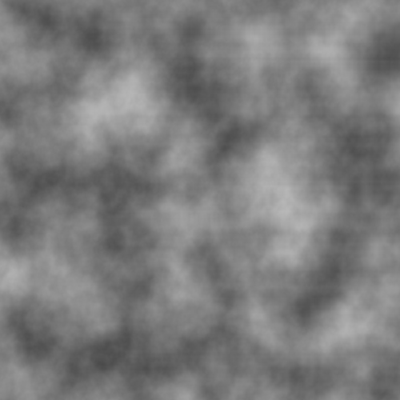

# Noises



## Overview

Visualizations different noiseand, for now, only Perlin noise is supported.

## Features

- Exports outputs to:
  - `perlin_noise.png` — visual representation of the noise.
  - `perlin_noise.json` — raw noise data in JSON format.
- Easy to build and extend for additional noise types in the future.

## Usage

1. **Build the application:**

   ```bash
   go build -o perlin_noise
   ```

2. **Run the application:**

   ```bash
   ./perlin_noise
   ```

3. **View the outputs:**
   - Check the current directory for the generated `perlin_noise.png` and `perlin_noise.json`.

## Future Enhancements

- Implement additional noise types (e.g., Simplex noise)
- Add configuration options for noise parameters
- Improve visualization and export functionalities
